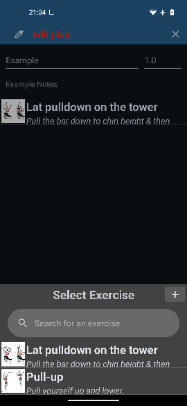
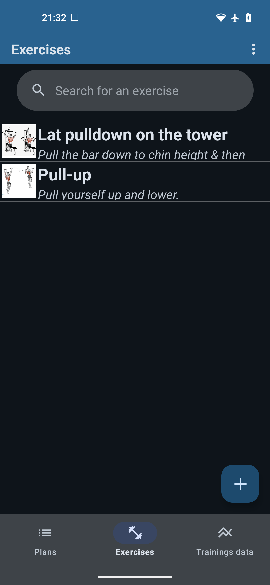
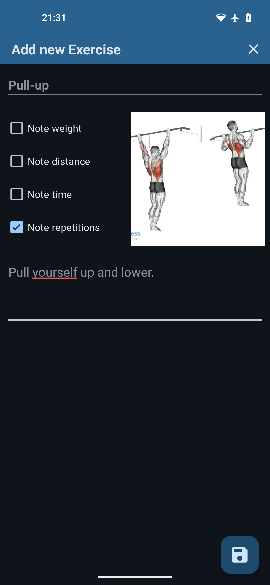

# GymTrim: Version 1.0 "halcyon" 
<p align="left">
  
</p>

[](LICENSE)
[](https://github.com/naibaf-1/GymTrim/commits)

## Purpose & Benefits
GymTrim is a fitness app designed to help you document your training data. While it can help you track your progress, **there is no guarantee that it will improve your athleticism or health**. All training data is recorded and stored locally on your device—**your data remains private and is never shared**.

## Features

### Store Plans & Exercises
- Easily add and edit exercises and plans directly in the app.
- Add images to exercises and colors to plans for easier recognition.
- Add notes to plans and exercises; all will be displayed during training.

### Training Mode
- Tick off completed repetitions during your workout.
- Get reminders for the next repetition (if activated in settings).
- Exercises are automatically marked as completed once finished.

### Track Your Progress
- During training, data such as average weight and exercise volume is automatically calculated and saved.
- After training, you can compare new data to previous training sessions.

### Calculators
- Built-in calculators, such as a BMI calculator, are available in the data section.

### Further Features
- Material You design (and default theme)
- Auto-save for all data
- Search for exercises and plans
- Different sounds for reminders
- Swipe-to-delete functionality
- English and German translations
- Light and dark mode
- Import and export data

## Screenshots







*(Not default theme shown)*

## Installation

**This app requires Android 8.0+**

### Installation via F-Droid
1. Install [F-Droid](https://f-droid.org/) on your device.
2. Search for **GymTrim**.
3. Tap **Install**.

### Installation via .apk file
1. Visit [F-Droid.org](https://f-droid.org/).
2. Search for **GymTrim**.
3. Select the app version you want.
4. Click **Download APK**.
5. Save the file, then use your file manager to find the `.apk`.
6. Tap the file and follow the on-screen instructions to install.

_You can also download the latest APK from the [Releases page](../../releases)._

## Contribution Guidelines

Everyone is welcome to participate in and adapt this project.  
All contributions and usage are governed by the [Apache 2.0 License](LICENSE).
Please see also [CONTRIBUTING.md](CONTRIBUTING.md) for guidelines.

### Getting Started

Clone the repository:

```bash
git clone https://github.com/naibaf-1/GymTrim.git
```
### Code of Conduct

Please note that this project adheres to a [Code of Conduct](CODE_OF_CONDUCT.md).  
By participating, you are expected to uphold this code.

### Attribution

If you fork and redistribute GymTrim, please include the following attribution in your documentation:

> Based on GymTrim by Fabian Bain (naibaf-1)

## Contact

You can contact me through GitHub—open an [issue](../../issues) or submit a pull request.

## License

This project is licensed under the [Apache License 2.0](LICENSE).

## Third-Party Libraries

This app uses the following open-source libraries:

- [AmbilWarna](https://github.com/yukuku/ambilwarna) by yukuku – [Apache License 2.0](https://www.apache.org/licenses/LICENSE-2.0)
- [MPAndroidChart](https://github.com/PhilJay/MPAndroidChart) by PhilJay – [Apache License 2.0](https://www.apache.org/licenses/LICENSE-2.0)
- [Picasso](https://github.com/square/picasso) by Square – [Apache License 2.0](https://www.apache.org/licenses/LICENSE-2.0)

This app also uses standard AndroidX and Google libraries as provided by the Android SDK.

## Third-Party Sounds

This app uses the following sounds:

- [notification beep](https://pixabay.com/de/sound-effects/notification-beep-229154/) by Universfield
- [notification #4](https://pixabay.com/de/sound-effects/notification-4-126507/) by Universfield
- [error call to attention](https://pixabay.com/de/sound-effects/error-call-to-attention-129258/) by Universfield
- [message](https://pixabay.com/de/sound-effects/message-13716/) by supremetylewiss
- [Confirm, Notification, Choice or Pop-up Sound Effect](https://pixabay.com/de/sound-effects/confirm-notification-choice-or-pop-up-sound-effect-221449/) by Lesiakower
- [Notification Sound 3](https://pixabay.com/de/sound-effects/notification-sound-3-262896/) by BenKirb
- [New Message 31](https://pixabay.com/de/sound-effects/new-message-31-183617/) by Tuomas_Data

## Disclaimer

This app was developed to improve and simplify my own training data tracking. It is **not intended to improve athleticism or health**.  
**No warranty is provided.**
