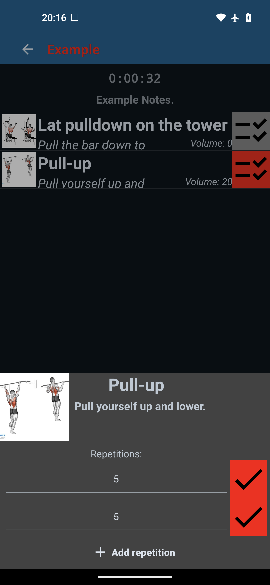

# GymTrim: Version v.2.0.2 "rose-breasted flycatcher"
<p align="left">
  
</p>

## Overview
- [Purpose & Benefits](#Purpose-&-Benefits)
- [Features](#Features)
- [Installation](#Installation)
- [Contribution Guidlines](#Contribution-Guidelines)
  - *[Open Tasks](#Open-Tasks)*
  - *[Getting Started](#Getting-Started)*
  - *[Code of Conduct](#Code-of-Conduct)*
  - *[Attribution](#Attribution)*
- [Contact](#Contact)
- [Legal & Privacy](#Legal-&-Privacy)
  - *[License](#License)*
  - *[Legal & Transparency Statement](#Legal-&-Transparency-Statement)*
  - *[Third-Party Libraries](#Third-Party-Libraries)*
  - *[Third-Party Sounds](#Third-Party-Sounds)*
  - *[Third-Party Assets](#Third-Party-Assets)*
  - *[Data Usage Notice](#Data-Usage-Notice)*
  - *[Security Notice](#Security-Notice)*
  - *[Disclaimer](#Disclaimer)*
- [Screenshots](#Screenshots)

## Purpose & Benefits
GymTrim is a fitness app designed to help you document your training data. While it can help you track your progress, **there is no guarantee that it will improve your athleticism or health**. All training data is recorded and stored locally on your device—**your data remains private and is never shared**.

## Features
### Store Plans & Exercises
- Easily add and edit exercises and plans directly in the app.
- Add images to exercises and colors to plans for easier recognition.
- Add notes to plans and exercises; all will be displayed during training.

### Training Mode
- Tick off completed repetitions during your workout.
- Get reminders for the next repetition (if activated in settings).
- Exercises are automatically marked as completed once finished.

### Track Your Progress
- During training, data such as average weight and exercise volume is automatically calculated and saved.
- After training, you can compare new data to previous training sessions.

### Calculators
- Built-in calculators, such as a BMI calculator, are available in the data section.

### Further Features
- Material You design (and default theme)
- Auto-save for all data
- Search for exercises and plans
- Different sounds for reminders
- Swipe-to-delete functionality
- English and German translations
- Light and dark mode
- Import and export data
- Update notifier

## Installation
**This app requires Android 7.0+**

### Installation via .apk file
1. Download the APK from the [Release page](../../releases/)
2. Select the app version you want.
3. Download the attached APK
4. Use your file manager to find the `.apk`.
5. Tap the file and follow the on-screen instructions to install.

## Contribution Guidelines
**Everyone is welcome** to participate in and adapt this project — whether you want to fix a typo, add a translation, or build a new feature.
All contributions and usage are governed by the [Apache 2.0 License](LICENSE).
Please see the full [CONTRIBUTING.md](CONTRIBUTING.md) for guidelines.
If you need help getting started, feel free to open an ISSUE — I’m happy to support you.

### Open Tasks
Here are the some easy ways to contribute:
- Add translations: *Spanish, French, Italian, Portuguese, Turkish, Polish, Dutch, Russian — or any language you speak*
- Improve the app icon (new design ideas are welcome)
- Report bugs you encounter
- Suggest new features you’d like to see
- Pick any open [ISSUE](https://github.com/naibaf-1/GymTrim/issues) and work on it

### Getting Started

Clone the repository:

```bash
git clone https://github.com/naibaf-1/GymTrim.git
```
### Code of Conduct

Please note that this project adheres to a [Code of Conduct](CODE_OF_CONDUCT.md).  
By participating, you are expected to uphold this code.

### Attribution

If you fork and redistribute GymTrim, please include the following attribution in your documentation:

> Based on GymTrim by Fabian Roland (naibaf-1)

## Contact
You can contact me through GitHub—open an [issue](../../issues) or submit a pull request.

## Legal & Privacy

### License
This project is licensed under the [Apache License 2.0](LICENSE).

### Legal & Transparency Statement
For details regarding data usage, third-party content, and security practices, please refer to this README.  
This document is intended to provide full transparency for users and complies with the requirements of the Apache License 2.0 and relevant privacy standards.

If this app is distributed via an app store, the store description may refer to this README for further information.

### Third-Party Libraries
This app uses the following open-source libraries:

- [AmbilWarna](https://github.com/yukuku/ambilwarna) by yukuku – [Apache License 2.0](https://www.apache.org/licenses/LICENSE-2.0)
- [MPAndroidChart](https://github.com/PhilJay/MPAndroidChart) by PhilJay – [Apache License 2.0](https://www.apache.org/licenses/LICENSE-2.0)
- [Picasso](https://github.com/square/picasso) by Square – [Apache License 2.0](https://www.apache.org/licenses/LICENSE-2.0)

This app also uses standard AndroidX and Google libraries as provided by the Android SDK.

### Third-Party Sounds
This app uses the following sounds:

- [notification beep](https://pixabay.com/de/sound-effects/notification-beep-229154/) by Universfield
- [notification #4](https://pixabay.com/de/sound-effects/notification-4-126507/) by Universfield
- [error call to attention](https://pixabay.com/de/sound-effects/error-call-to-attention-129258/) by Universfield
- [message](https://pixabay.com/de/sound-effects/message-13716/) by supremetylewiss
- [Confirm, Notification, Choice or Pop-up Sound Effect](https://pixabay.com/de/sound-effects/confirm-notification-choice-or-pop-up-sound-effect-221449/) by Lesiakower
- [Notification Sound 3](https://pixabay.com/de/sound-effects/notification-sound-3-262896/) by BenKirb
- [New Message 31](https://pixabay.com/de/sound-effects/new-message-31-183617/) by Tuomas_Data

### Third-Party Assets
This app uses icons from the [Material Icons Library](https://fonts.google.com/icons) by Google, licensed under the [Apache License 2.0](https://www.apache.org/licenses/LICENSE-2.0).
© Google. Licensed under the Apache License, Version 2.0.

### Data Usage Notice
This app stores training-related data locally on the device to track progress and visualize workout history.
No personal data (such as name, email, location, or device identifiers) is collected, stored, or transmitted. All stored data is anonymous and used solely for functionality within the app.
Users can delete all stored data at any time via the app settings.

### Security Notice
This app stores training data locally on the device. While no personal data is collected or transmitted, users should be aware that unencrypted data may be accessible to other apps on the same device.
To mitigate this risk, we recommend using devices with secure storage and keeping your system up to date. Future versions may include optional encryption features.
All data remains local and anonymous. Users can delete all stored data at any time via the app settings.

### Disclaimer
This app was developed to improve and simplify my own training data tracking. It is **not intended to improve athleticism or health**.  
**No warranty for anything is provided.**

## Screenshots
| <br>**List your plans**| <br>**Edit a plan**| <br>**Train a plan** |
|-------------------------------------------------------------------------------|-------------------------------------------------------------------|--------------------------------------------------------------------|
|  <br><div align="center">**See all of your exercises**</div> |  <br><div align="center">**Add new exercises**</div> |  <br><div align="center">**Edit your old exercises**</div> |
|  <br><div align="center">**See your efforts**</div> |  <br><div align="center">**Toggle the settings**</div> |  <br><div align="center">**Find further informations**</div> |

*(Not default theme shown)*
